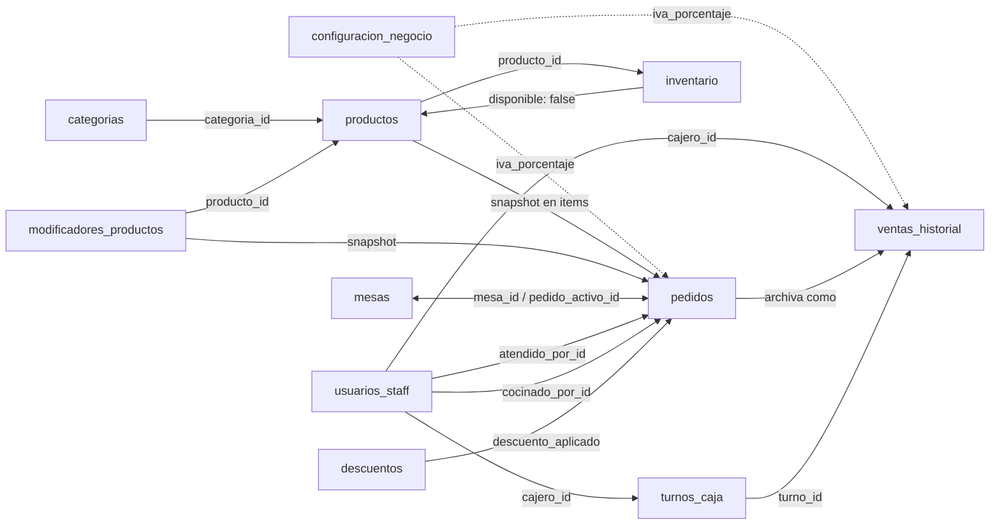

# Smart Order App — Esquema de Base de Datos (Firestore)

> **Fuente de verdad** para la estructura de todas las colecciones del sistema.
> Cualquier servicio, modelo o función debe respetar este esquema.

---

## A. `configuracion_negocio`

Documento único con parámetros globales del negocio. Alimenta tickets, pantalla de bienvenida y cálculos de impuestos.

```json
{
  "nombre_comercial": "Nombre del Restaurante",
  "direccion": "Calle Falsa 123",
  "telefono": "+52 123 456 789",
  "moneda": "MXN",
  "iva_porcentaje": 16,
  "horario_atencion": "12:00 - 22:00"
}
```

**Vínculos:**
- PWA del cliente → nombre en pantalla de bienvenida
- `pedidos` y `ventas_historial` → `iva_porcentaje` al momento del cierre

---

## B. `categorias`

Agrupaciones visuales del menú (pestañas). Permiten reordenar, cambiar ícono o desactivar una categoría completa sin editar productos.

```json
{
  "id": "cat_01",
  "nombre": "Pizzas Gourmet",
  "orden_visual": 1,
  "icono_url": "https://servidor.com/icons/pizza.png",
  "activa": true
}
```

**Vínculos:**
- `productos.categoria_id` → apunta aquí
- `activa: false` → oculta todos los productos de esa categoría

---

## C. `productos`

Catálogo maestro del restaurante. Fuente de verdad del menú visible al cliente.

```json
{
  "id": "prod_pizza_01",
  "nombre": "Pizza Pepperoni",
  "descripcion": "Pizza artesanal con 20 rodajas de pepperoni.",
  "precio": 125.00,
  "categoria_id": "cat_01",
  "disponible": true,
  "imagen_url": "https://servidor.com/fotos/pizza_pepperoni.jpg"
}
```

**Vínculos:**
- `categoria_id` → `categorias`
- ID referenciado en `pedidos.items` (`nombre` y `precio` se copian como snapshot)
- `inventario` tiene un doc por cada producto, vinculado por `producto_id`
- `disponible` es controlado automáticamente cuando el stock cae bajo el mínimo en `inventario`

---

## D. `modificadores_productos`

Grupos de opciones personalizables por producto (tamaño, extras, ingredientes). Impactan el precio base de forma estructurada.

```json
{
  "id": "mod_grupo_01",
  "producto_id": "prod_pizza_01",
  "nombre": "Tamaño",
  "obligatorio": true,
  "seleccion_multiple": false,
  "opciones": [
    { "id": "op_chica", "nombre": "Chica", "precio_adicional": 0.00 },
    { "id": "op_mediana", "nombre": "Mediana", "precio_adicional": 30.00 },
    { "id": "op_grande", "nombre": "Grande", "precio_adicional": 60.00 }
  ],
  "activo": true
}
```

**Snapshot en `pedidos.items.modificadores_aplicados`:**
```json
{
  "grupo_id": "mod_grupo_01",
  "opcion_id": "op_mediana",
  "nombre": "Tamaño Mediana",
  "precio_adicional_snapshot": 30.00
}
```

**Vínculos:**
- `producto_id` → `productos`
- `activo: false` → ignorado, no puede incluirse en pedidos nuevos

---

## E. `mesas`

Estructura física del restaurante. Controla estado en tiempo real y persistencia de sesión (múltiples comensales → mismo pedido).

```json
{
  "id": "mesa_05",
  "numero": 5,
  "estado": "ocupada",
  "pedido_activo_id": "ORD-7742"
}
```

**Valores de `estado`:** `"libre"` | `"ocupada"` | `"sucia"`
- `pedido_activo_id: null` → mesa libre

**Vínculos:**
- `pedido_activo_id` → `pedidos` (se limpia al cerrar pedido)
- KDS y App del Mesero usan `mesa_id` del pedido para localizar entregas

---

## F. `pedidos`

Documento más complejo. Fotografía del consumo en tiempo real. Puente entre comensal, cocina y personal de sala.

```json
{
  "id": "ORD-7742",
  "mesa_id": "mesa_05",
  "cliente_uid": "anon_abc123",
  "atendido_por_id": "UID_FIREBASE_AUTH_456",
  "cocinado_por_id": "UID_FIREBASE_AUTH_789",
  "estado": "en_preparacion",
  "items": [
    {
      "producto_id": "prod_chilaquiles_01",
      "nombre": "Chilaquiles Verdes",
      "precio_snapshot": 110.00,
      "cantidad": 1,
      "especificaciones": "Sin cebolla y con un huevo estrellado",
      "modificadores_aplicados": []
    },
    {
      "producto_id": "prod_cafe_02",
      "nombre": "Cappuccino",
      "precio_snapshot": 55.00,
      "cantidad": 1,
      "especificaciones": "Con leche de almendras",
      "modificadores_aplicados": []
    }
  ],
  "descuento_aplicado": {
    "descuento_id": "desc_lunes_bebidas",
    "nombre": "Lunes de bebidas 2x1",
    "monto_descontado": 27.50
  },
  "subtotal": 165.00,
  "total": 137.50,
  "timestamp": "2026-02-16T18:30:00Z"
}
```

**Valores de `estado`:** `"pendiente"` → `"en_preparacion"` → `"listo"` → `"entregado"` → `"pagado"`

**Vínculos:**
- `mesa_id` → `mesas` (recíproco con `pedido_activo_id`)
- `atendido_por_id`, `cocinado_por_id` → `usuarios_staff`
- `precio_snapshot` y `modificadores_aplicados` → copias inmutables del catálogo
- `descuento_aplicado` → snapshot del descuento vigente
- Al marcarse `"pagado"` → se archiva en `ventas_historial`, mesa libera `pedido_activo_id`

---

## G. `usuarios_staff`

Identidad y control de acceso del personal. ID generado por Firebase Authentication.

```json
{
  "id": "UID_FIREBASE_AUTH_123",
  "nombre": "Elena Rodríguez",
  "email": "elena.staff@restaurante.com",
  "rol": "mesero",
  "pin_acceso": "4421",
  "activo": true,
  "fecha_ingreso": "2026-01-10T10:00:00Z"
}
```

**Valores de `rol`:** `"admin"` | `"cocina"` | `"mesero"` | `"cajero"`
- `pin_acceso` es opcional (cambios rápidos de turno en tablet compartida)

**Vínculos:**
- `pedidos` → `atendido_por_id`, `cocinado_por_id`
- `ventas_historial` → `cajero_id`
- `turnos_caja` → `cajero_id`
- Roles `admin` y `cocina` tienen acceso a colecciones restringidas

---

## H. `descuentos`

Catálogo de promociones, cupones y descuentos con validación automática. Solo `admin` puede gestionar.

```json
{
  "id": "desc_lunes_bebidas",
  "nombre": "Lunes de bebidas 2x1",
  "tipo": "porcentaje",
  "valor": 50,
  "condiciones": {
    "dias_semana": [1],
    "hora_inicio": "14:00",
    "hora_fin": "17:00",
    "categoria_id": "cat_bebidas",
    "producto_id": null,
    "monto_minimo_pedido": 0.00,
    "roles_aplicables": ["todos"]
  },
  "codigo_cupon": null,
  "usos_maximos": null,
  "usos_actuales": 0,
  "activo": true,
  "fecha_inicio": "2026-02-01T00:00:00Z",
  "fecha_fin": "2026-06-30T23:59:59Z"
}
```

**Valores de `tipo`:** `"porcentaje"` | `"monto_fijo"`
- `codigo_cupon: null` → aplica automáticamente según condiciones
- `usos_actuales` solo incrementado por el servidor

**Vínculos:**
- Al aplicar → ID y monto se copian en `pedidos.descuento_aplicado`
- Condiciones validadas por el servidor al momento del pago
- `usos_actuales` incrementado por Cloud Function al registrar venta
- Viaja con el pedido a `ventas_historial` para reportes de margen

---

## I. `inventario`

Insumos por producto. Retira automáticamente del menú platillos cuando ingredientes se agotan.

```json
{
  "id": "inv_prod_pizza_01",
  "producto_id": "prod_pizza_01",
  "insumos": [
    {
      "nombre": "Masa de pizza",
      "unidad": "piezas",
      "stock_actual": 40,
      "stock_minimo": 10
    },
    {
      "nombre": "Pepperoni",
      "unidad": "gramos",
      "stock_actual": 2000,
      "stock_minimo": 500
    }
  ],
  "alerta_activa": false,
  "ultima_actualizacion": "2026-02-17T12:00:00Z",
  "actualizado_por_id": "UID_FIREBASE_AUTH_123"
}
```

**Vínculos:**
- `producto_id` → `productos`
- Pedido pasa de `"pendiente"` a `"en_preparacion"` → Cloud Function descuenta `stock_actual`
- `stock_actual < stock_minimo` → `alerta_activa: true` + `productos.disponible: false`
- Solo `admin` puede modificar stock manualmente o reactivar producto

---

## J. `turnos_caja`

Ciclo completo de apertura/cierre de caja. Toda venta debe estar asociada a un turno abierto.

```json
{
  "id": "turno_2026021701",
  "cajero_id": "UID_FIREBASE_AUTH_123",
  "fecha_apertura": "2026-02-17T08:00:00Z",
  "fecha_cierre": "2026-02-17T16:00:00Z",
  "fondo_inicial": 500.00,
  "estado": "cerrado",
  "resumen_ventas": {
    "total_efectivo": 3200.00,
    "total_tarjeta": 5800.00,
    "total_ventas": 9000.00,
    "num_transacciones": 47
  },
  "diferencia_caja": 15.00,
  "notas_cierre": "Diferencia por cambio en efectivo."
}
```

**Valores de `estado`:** `"abierto"` | `"cerrado"`
- Una vez `"cerrado"` → inmutable (excepto `notas_cierre`, 24h, solo `admin`)
- Solo un turno `"abierto"` por cajero a la vez

**Vínculos:**
- `cajero_id` → `usuarios_staff`
- `ventas_historial.turno_id` → referencia este documento
- `resumen_ventas` se calcula automáticamente al cerrar

---

## K. `ventas_historial`

Archivo inmutable. Fuente de verdad para contabilidad y auditoría. Nadie puede modificar ni eliminar.

### Caso 1: Ticket Simple (Consumidor Final)
```json
{
  "id": "VTA_2026_001",
  "pedido_id": "ORD-5520",
  "cajero_id": "UID_FIREBASE_AUTH_123",
  "turno_id": "turno_2026021701",
  "fecha_pago": "2026-02-17T14:30:00Z",
  "metodo_pago": "efectivo",
  "subtotal": 135.00,
  "impuestos": 21.60,
  "total_pagado": 156.60,
  "descuento_aplicado": null,
  "detalles_cliente": {
    "nombre": "Consumidor Final",
    "email": null,
    "datos_fiscales": null
  },
  "items_vendidos": [
    { "producto_id": "prod_chilaquiles_01", "nombre": "Chilaquiles Verdes", "precio_snapshot": 110.00, "cantidad": 1 },
    { "producto_id": "prod_cafe_02", "nombre": "Americano", "precio_snapshot": 25.00, "cantidad": 1 }
  ]
}
```

### Caso 2: Ticket con Factura
```json
{
  "id": "VTA_2026_002",
  "pedido_id": "ORD-5521",
  "cajero_id": "UID_FIREBASE_AUTH_123",
  "turno_id": "turno_2026021701",
  "fecha_pago": "2026-02-17T15:15:00Z",
  "metodo_pago": "tarjeta",
  "subtotal": 110.00,
  "impuestos": 17.60,
  "total_pagado": 127.60,
  "descuento_aplicado": {
    "descuento_id": "desc_lunes_bebidas",
    "nombre": "Lunes de bebidas 2x1",
    "monto_descontado": 27.50
  },
  "detalles_cliente": {
    "nombre": "Juan Pérez López",
    "email": "juan.perez@email.com",
    "datos_fiscales": "RFC: PELJ800101XXX, Calle Reforma 123, CP 06000"
  },
  "items_vendidos": [
    { "producto_id": "prod_chilaquiles_01", "nombre": "Chilaquiles Verdes", "precio_snapshot": 110.00, "cantidad": 1 }
  ]
}
```

**Vínculos:**
- `cajero_id` → `usuarios_staff`
- `turno_id` → `turnos_caja`
- `subtotal` e `impuestos` calculados con `configuracion_negocio.iva_porcentaje` al momento del pago
- `descuento_aplicado` → snapshot preservado aunque el descuento se elimine del catálogo
- Al generarse → mesa limpia `pedido_activo_id`, cambia a `"sucia"` o `"libre"`

---

## Diagrama de Relaciones


